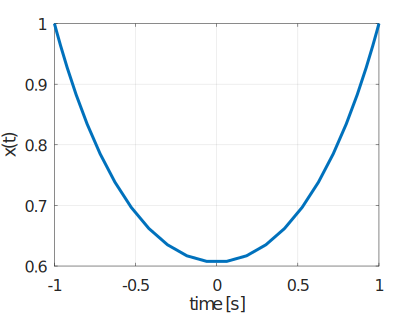
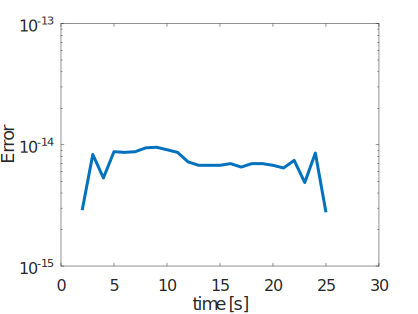
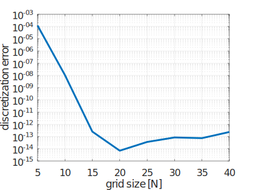

## Pseudospectral methods for boundary value problems

Given below is a boundary value problem from Ref. [^1]. 

$$ 
\begin{equation}
\ddot{x}-t\dot{x}-x=0
\end{equation}
$$

$$ 
\begin{aligned}
x(t=-1)&=1\\
x(t=1)&=1
\end{aligned}
$$

$x^*(t)=\exp(\frac{t^2-1}{2})$ is the solution to the boundary value problem.

### Numerical solution
Pseudospectral collocation requires the following steps
1. discretize domain, state and control at $n+1$ points
2. discrete state and control input are the variables
3. approximate state $(x(t))$ and control $(u(t))$ using global polynomials
4. differentiate the polynomial to the required degree and evaluate at the collocation points
5. evaluate the boundary value problem at the collocation points
    * dynamics evaluated at interior points
    * boundary conditions at -1 and 1
8. depending on the dynamics, system of linear/nonlinear system of equations need to be solved

## Implementation

An optimization problem without an objective function and inequality constraints is simply a system of equation which may be linear or nonlinear.
Using the principle, we use IPOPT to solve the system of nonlinear equations. CasADi's ```Opti()``` (meant as modelling language for optimization problems) is used to model the equations.
The codes serve the following purposes.

* ```bvp_main.m``` - solve the BVP for a given grid size and compare with analytical solution
* ```bvp.m, convergence.m``` - study exponential/spectral convergence of discretization error
* ```legslb.m, legslbdiff.m, lepoly.m, lepolym.m``` - supplementary files for LGL collocation

## Requirements
* OCTAVE-6.1.0
* CasADi-3.5.5

## Comparison of numerical and analytical results

### side by side plot 


### error plot


### Spectral/exponential convergence

A key feature of pseudospectral collocation is rapid decrease in discretization error with increasing grid size. However, for larger N ($\geq 100$),
the problem can get numerically ill-conditioned.

Some methods to mititgate ill-conditioning include using knotting, preconditioners and Birkhoff collocation.



## References

[^1]: Wang, L. L., Samson, M. D., & Zhao, X. (2014). A well-conditioned collocation method using a pseudospectral integration matrix. SIAM Journal on Scientific Computing, 36(3), A907-A929.
